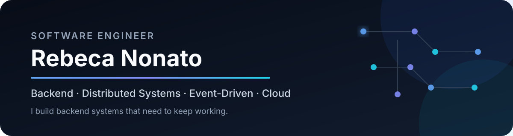

  

  Portfolio: <a href="https://rebecanonato89.dev/#/pt-BR/">Português</a> · <a href="https://rebecanonato89.dev/#/en/">English</a> · <a href="https://rebecanonato89.dev/#/zh-CN/">中文</a>

  <a href="https://rebecanonato89.dev"><strong>Portfólio</strong></a>
  &nbsp;&nbsp;·&nbsp;&nbsp;
  <a href="https://www.linkedin.com/in/rebecanonato89/"><strong>LinkedIn</strong></a>
  &nbsp;&nbsp;·&nbsp;&nbsp;
  <a href="mailto:rebecanonato89@gmail.com"><strong>Contato</strong></a>

## About

Software Engineer with **10+ years building, modernizing and operating backend systems**. Currently focused on distributed systems, event-driven architecture, reliability and software evolution.

Main stack: **Kotlin · Java · Node.js/TypeScript · AWS**, connecting architectural decisions to real system behavior in production.

## Selected Engineering Work

<table>
  <tr>
    <td colspan="2" valign="top">
      <h3>01 · <a href="https://github.com/fiap-tech-challenge-java/clinicfiapp-monorepo">ClinicFiapApp</a></h3>
      
<strong>Academic collaborative project</strong>

      
Backend distribuído com comunicação assíncrona, consistência confiável e leitura orientada a eventos.

      <code>Java</code> <code>Spring</code> <code>Kafka</code> <code>CQRS</code> <code>Outbox</code> <code>Idempotency</code> <code>DLQ</code>
    </td>
  </tr>
  <tr>
    <td width="50%" valign="top">
      <h3>02 · <a href="https://github.com/fiap-tech-challenge-java/food-fiapp">Food Fiapp</a></h3>
      
<strong>Academic project</strong>

      
Clean Architecture protegida por regras automatizadas e quality gate no build.

      <code>Java 21</code> <code>Spring Boot</code> <code>Clean Architecture</code> <code>ArchUnit</code>
    </td>
    <td width="50%" valign="top">
      <h3>03 · <a href="https://github.com/rebecanonato89/hedge-cli">Hedge CLI</a></h3>
      
<strong>Independent Software Engineering Research</strong>

      
Análise estática seletivamente combinada a LLM para detectar Eager Test em código Java.

      <code>Static Analysis</code> <code>AST</code> <code>Heuristics</code> <code>LLM</code>
    </td>
  </tr>
  <tr>
    <td width="50%" valign="top">
      <h3>04 · <a href="https://github.com/rebecanonato89/quotes-service">Quotes Service</a></h3>
      
<strong>Personal project</strong>

      
Modelagem de regras de negócio, eventos de domínio e processamento assíncrono.

      <code>Kotlin</code> <code>DDD</code> <code>Coroutines</code> <code>Domain Events</code>
    </td>
    <td width="50%" valign="top">
      <h3>05 · <a href="https://github.com/fiap-tech-challenge-java/fiap-tech-challenge">TechChallenge</a></h3>
      
<strong>Academic project</strong>

      
Domínio isolado por Arquitetura Hexagonal, com autenticação e autorização.

      <code>Java 21</code> <code>Hexagonal Architecture</code> <code>Spring Security</code> <code>JWT</code>
    </td>
  </tr>
  <tr>
    <td colspan="2" valign="top">
      <h3>06 · <a href="https://github.com/rebecanonato89/kube-backend">Kube Backend</a></h3>
      
<strong>Infrastructure lab</strong>

      
API Node.js/Express e PostgreSQL executados em Kubernetes local com recursos declarativos de infraestrutura.

      <code>Node.js</code> <code>Express</code> <code>Docker</code> <code>Kubernetes</code> <code>PostgreSQL</code>
    </td>
  </tr>
</table>

## Engineering Capabilities

<table>
  <tr>
    <td width="33%" valign="top"><strong>Backend</strong>  Kotlin · Java · Node.js Spring Boot · NestJS PostgreSQL</td>
    <td width="34%" valign="top"><strong>Distributed Systems</strong>  Kafka · SQS · Event-Driven CQRS · Outbox Idempotency · DLQ</td>
    <td width="33%" valign="top"><strong>Architecture</strong>  DDD · Clean Architecture Hexagonal · Microservices Multi-Tenant</td>
  </tr>
  <tr>
    <td colspan="2" valign="top"><strong>Cloud & Reliability</strong>  AWS · Docker · Kubernetes · Datadog · CloudWatch · CI/CD</td>
    <td valign="top"><strong>Engineering Quality</strong>  TDD · Automated Tests · ArchUnit · Observability · Code Review</td>
  </tr>
</table>

## Experience, briefly

`Health tech / Kotlin & Event-Driven` → `Accenture / distributed & serverless AWS` → `backend, integrations & corporate systems`

Minha trajetória inclui evolução de sistemas em produção, observabilidade, incidentes, code review, decisões de arquitetura e colaboração entre engenharia e produto. A experiência completa está no [portfólio](https://rebecanonato89.dev/#experiencia) e no [LinkedIn](https://www.linkedin.com/in/rebecanonato89/).

## Built for humans and machines

O [portfólio](https://rebecanonato89.dev) foi estruturado para pessoas, mecanismos de busca e agentes: **Accessibility · Structured Data · JSON Resume · LLM-readable · Prerendered content**.

  Backend · Distributed Systems · Event-Driven · Cloud & Reliability

